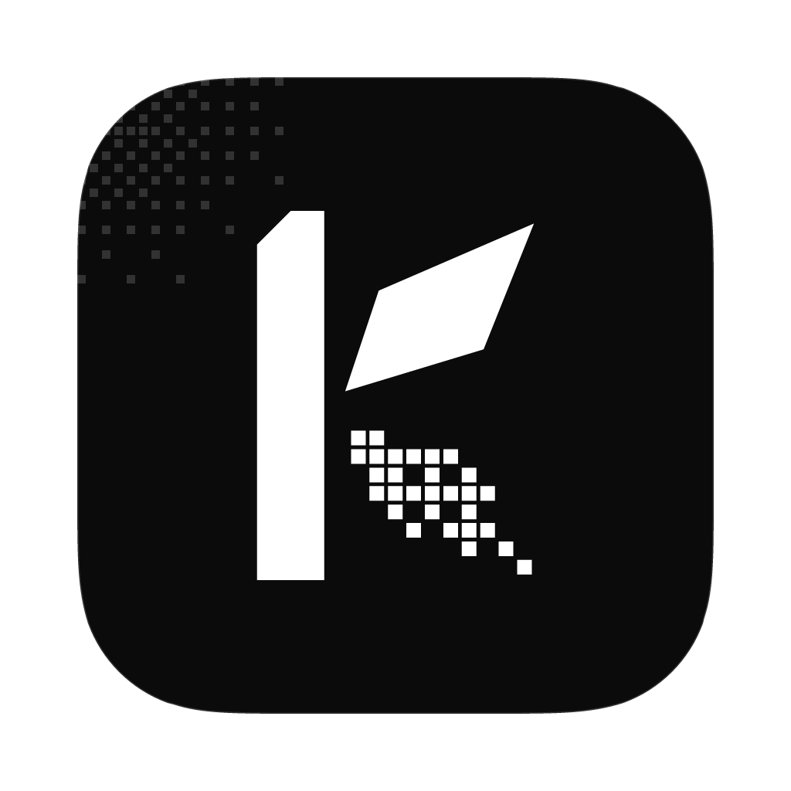

<p align="center">
  
</p>
<p align="center">
  <a href="https://lsuite.xyz/kimchi">Website</a> ·
  <a href="https://github.com/ludovic111/kimchi/releases/latest">Download</a> ·
  <a href="https://lsuite.xyz/kimchi/support">Sponsor</a>
</p>

<h1 align="center">kimchi</h1>

<p align="center"><strong>An open-source video editor where generative models are part of the cut.</strong><br/>
Native Rust app (GPUI) · drivable by your AI (MCP, CLI, built-in agent) · bring your own keys, or run everything locally.<br/>
Part of <a href="https://lsuite.xyz">lsuite</a>, the free, open-source creative suite your AI can drive.</p>

---

kimchi is a desktop video editor with a built-in harness for image and video
generation models. Prompt a shot straight onto the timeline, animate a frame you
like, extend a clip from its last frame, or bridge two shots with a generated
transition, then cut, trim and export it like any other footage.

It started as a fork of [OpenCut](https://github.com/OpenCut-app/OpenCut) and was
rewritten from the ground up in Rust.

## What it does

**Editing**
- Multi-track timeline: video, image, text, solid and audio clips
- Split, trim, ripple delete, duplicate, copy / cut / paste, cross-track moves, snapping, markers
- Rubber-band selection, ⌥-drag to copy, files dropped straight onto a track
- The shortcuts editors expect: J / K / L shuttle, ↑ / ↓ to the previous / next cut, Q / W trim to the playhead; press ? for all of them
- Per-clip transform (position, scale, rotation, opacity, blur, fit), speed (pitch kept), reverse, freeze frames, fades, volume
- **Transitions** on cuts: dissolve, dip to black / white, wipes, slides, pushes, zoom, iris, blur; centred on the cut with the clips' media past it, the sound crossfading. Click the + on a cut, drag the badge's edges for the length
- **Colour**: looks (punchy, warm, cool, mono, faded, vintage, noir, teal & orange, dreamy), brightness, contrast, saturation, warmth, tint, vignette, sharpen (all keyframable), green-screen chroma key, `.cube` LUTs
- **Captions**: transcribe the cut on your computer (Whisper, nothing sent anywhere; the model downloads once), import and export SRT / WebVTT, edit them as titles, style them all at once; burned in or as an `.srt` beside the export
- Live preview compositor, on-canvas move/scale handles
- Snapshot undo/redo for every edit, autosave
- Export to MP4 (H.264), HEVC, ProRes, WebM, GIF or audio-only

**Sound and Ryolune**
- A Rust mixer shared by playback, exports and speech transcription: clip and track gain/pan, editable fade shapes, buses, sends, automation, ducking, meters and a master true-peak limiter
- Ryolune's stock effects and plugin host, with searchable effect lists and parameter panels; CLAP, VST3, native plugins and Audio Units on macOS, subject to the plugin and platform
- Loudness measurement and normalization, beat detection, beat snapping and cuts on music beats
- Voice-over recording with a count-in; finish a take to place it on an audio track, with undo
- Import `.ryolune` songs as mixes or stems, refresh after changes, and send an editable multitrack audio session back to Ryolune
- WAV (16/24-bit or float), AIFF, FLAC, MP3, AAC, Opus and Ogg exports, with sample rate, bitrate, stems and loudness options

**A window that fits**
- Side panels become drawers on small windows; dialogs and popovers fit the available space, and inspector sections fold
- Real provider and app logos in menus, settings and generation results

**Animation, motion graphics and 3D** (drawn by kimchi, the same in the preview and the export)
- **Keyframes on any clip**: position, scale, rotation, opacity, blur, volume, text size and colour, with easings (ease, back, elastic, bounce, cubic-bezier, spring). Toggle a keyframe per property at the playhead in the inspector, or drag on the canvas
- **Presets**: fade, rise, slide, pop, zoom, focus in and out; Ken Burns, pan, pulse, float, shake, spin
- **2D motion design, like After Effects**: shapes, paths (with draw-on), text, images, particles, nulls, adjustment layers and nested compositions with time remap; parenting, masks (add, subtract, intersect, feathered), track mattes (alpha and luma), blend modes; 34 effects (blurs, glow, drop shadow, outline, echo, colour correction, levels, tint, gradient ramp, fractal noise, grain, halftone, turbulent displace, wave warp, ripple, twirl, bulge, mosaic, chromatic aberration, glitch, kaleidoscope, motion tile, corner pin…), shape operators (repeater, zig zag, wiggle, offset, round corners, twist, pucker & bloat), text animators (range and wiggly selectors), text on a path, motion blur
- **3D, like Blender**: primitives (box, sphere, icosphere, cylinder, cone, capsule, torus, plane, grid), extruded text and logos (SVG paths, holes kept), lathed profiles, curve tubes that draw on, glTF / OBJ / STL models, and editable meshes (extrude, inset, bevel, loop cut, subdivide, bridge, spin, knife…); a modifier stack (subdivision, mirror, array, bevel, solidify, boolean, displace, twist, bend, taper, wave, wireframe, explode, build…); constraints (look at, follow a path, copy, limit); cameras with depth of field, orthographic views and cuts between cameras; directional, point, spot and area lights with soft shadows; environments (gradient, sky, 360° panorama); materials with glass, metal, clear coat, textures and procedural patterns (marble, wood, checker, cells…); particles; bloom, motion blur, ambient occlusion and filmic tone mapping
- **Two render engines**: a fast GPU engine (Metal on Macs, Apple Silicon included; Vulkan or DirectX 12 elsewhere; on the CPU otherwise) and a path tracer for real reflections, refraction through glass, soft light and bounced light
- **Expressions** on any property: `wiggle(2, 30)`, `loopOut("pingpong")`, `time * 90`, `prop("ball", "x") + 100`, staggering by `index`
- **The Studio**: a workspace for a motion clip with an outliner, a 3D viewport (orbit, move / rotate / scale handles, edit mode) or a 2D canvas (handles, pen tool), the properties of what's selected (modifiers, effects, materials, expressions, world and render settings), a dope sheet and a graph editor
- **Camera navigation**: drag the visible orbit, pan and zoom controls, use the axis ball, or fly with WASD/QE. The Camera menu can lock the scene camera to your view, align it, add cameras and apply editable camera moves. The 2D canvas has visible pan, zoom and fit controls.
- **Render now or at export**: a motion clip is drawn live (quick in the preview, full quality in the export), or rendered ahead into a file the timeline plays smoothly; edit the scene and it goes back to live until you render it again
- **Templates**: lower third, title card, kinetic type, counter, bar chart, logo reveal, callout, quote, subscribe button, aurora background, wipe transition, glitch title, particle burst, kinetic sweep, radial burst, liquid background, 3D title, 3D logo spin, turntable, floating shapes, product shot, extruded logo, particle field, morphing blob; change their words and colours in the inspector
- **Ask the agent**: it writes the scene (`motion.guide` explains every feature), models meshes, then looks at the frames it made from any angle
- Hardware encoding where the computer has it (Apple VideoToolbox, NVIDIA NVENC, AMD AMF, Intel Quick Sync, VA-API), checked with a test encode and redone on the CPU if it fails; 4K, HEVC and ProRes sources decode in hardware

**Generation, woven into the edit**
- **Generate at the playhead.** A placeholder clip appears where the shot will go and turns into the result when it's done
- **Generate in a gap.** Right-click empty space on a track; the shot is sized to fill it
- **Animate this frame.** Turn the frame under the playhead into a moving shot (image-to-video)
- **Extend shot.** Continue a clip from its last frame, landing right after it
- **Bridge two shots.** First frame and last frame, from the clips on either side
- **Restyle frame.** Edit a still with an image model
- **Provenance.** Every generated asset remembers its prompt, model, seed and inputs: regenerate or make variations in one click
- Start a project from a prompt on the home screen, or type one into the command palette (⌘K)

## Models

Keys live in your OS keychain (or come from the usual environment variables) and
are only sent to the provider they belong to.

| Provider | Kind | Images | Video |
|---|---|:-:|:-:|
| [OpenRouter](https://openrouter.ai) | cloud | ✓ | ✓ |
| [fal](https://fal.ai) | cloud | ✓ | ✓ |
| [Replicate](https://replicate.com) | cloud | ✓ | ✓ |
| [OpenAI](https://platform.openai.com) | cloud | ✓ | |
| [Google Gemini](https://ai.google.dev) | cloud | ✓ | ✓ |
| [xAI](https://x.ai/api) | cloud | ✓ | ✓ |
| [Runway](https://dev.runwayml.com) | cloud | ✓ | ✓ |
| [Luma AI](https://lumalabs.ai/api) | cloud | ✓ | ✓ |
| [Black Forest Labs](https://bfl.ai) | cloud | ✓ | |
| [Stability AI](https://platform.stability.ai) | cloud | ✓ | |
| [Together AI](https://together.ai) | cloud | ✓ | ✓ |
| [ComfyUI](https://www.comfy.org) | local | ✓ | ✓ |
| Stable Diffusion WebUI (A1111, Forge, SD.Next, Draw Things) | local | ✓ | |
| [Ollama](https://ollama.com) | local | ✓ | |
| Any OpenAI-compatible images server (LocalAI, vLLM-Omni, sd-server…) | local | ✓ | |

Model lists are fetched live where the provider exposes them, and every model
declares what it can do (aspect ratios, durations, resolutions, first/last frame,
reference images, sound), so the generate panel only shows controls that apply.

### Your own ComfyUI workflows

Export a workflow in API format into `~/Documents/kimchi/comfyui-workflows` (or
set another folder in Settings → Models & keys → ComfyUI). Each file becomes a
model. Put placeholders in any string input and kimchi fills them in:

`{{prompt}}` `{{negative_prompt}}` `{{seed}}` `{{width}}` `{{height}}`
`{{steps}}` `{{cfg}}` `{{denoise}}` `{{duration}}` `{{fps}}` `{{frames}}`
`{{image}}` / `{{start_image}}` `{{end_image}}` (uploaded for you)

A value that is exactly one numeric placeholder becomes a number. Workflows with
a video save node are treated as video models; an optional
`<name>.kimchi.json` sidecar can set the name, tasks and defaults.

## Drive it from AI and scripts

Everything you can do in the window is a named command (`clip.split`, `generate.extendClip`,
`export.start`…, see [docs/COMMANDS.md](docs/COMMANDS.md)), and the window, the built-in agent,
`kimchi-cli` and `kimchi-mcp` all go through the same registry and share one undo history.

```bash
claude mcp add kimchi -- /Applications/kimchi.app/Contents/MacOS/kimchi-mcp --live   # Claude Code
kimchi-cli project.overview                                                           # the running app
kimchi-cli --file cut.json clip.addText text="Opening title"                           # a project file
```

The **Agent** panel (⌘J) runs the model you already have (Claude Code, Codex, an Anthropic or OpenAI key, or a
local Ollama model), shows one card per command and lets you revert a whole run. What agents may do
(files, projects, generation, settings, quitting) is set in Settings › Agent, for the built-in agent and MCP alike.
kimchi hands cuts to [ryolune](https://lsuite.xyz/ryolune) to score them and takes its audio back
(`handoff.toRyolune`, `handoff.fromRyolune`). Details: [docs/AI_CONTROL.md](docs/AI_CONTROL.md).

## Documentation

- [User guide](docs/guide/README.md): the window, from a first cut to motion graphics, sound, generation and export
- [Keyboard shortcuts](docs/guide/shortcuts.md)
- [Controlling kimchi from AI and scripts](docs/AI_CONTROL.md) and the [command reference](docs/COMMANDS.md)
- [Configuration](docs/CONFIGURATION.md): settings, environment variables, files and folders
- [The project file](docs/PROJECT_FORMAT.md)
- [Architecture](docs/ARCHITECTURE.md) and [development](docs/DEVELOPMENT.md), for working on kimchi itself

## Architecture

```
crates/
  kimchi-core      project model, edits, undo history (shared by every client), keyframes, motion scenes, meshes and
                   modifiers, expressions, particles, templates
  kimchi-media     ffmpeg probing, decoding and encoding; the compositor: text, 2D motion and effects, 3D (GPU, CPU and
                   the path tracer), colour, transitions, motion clips rendered ahead
  kimchi-captions  SRT / WebVTT, and speech to text with Whisper (candle, on the CPU)
  kimchi-gen       the generation harness: Provider trait, 15 providers, keys, job queue
  kimchi-control   the command registry, session, permissions, loopback bridge, lsuite discovery, updater
  kimchi-agent     the built-in agent (Claude Code, Codex, Anthropic, OpenAI, Ollama)
  kimchi-desktop   the window (GPUI), binary `kimchi`
  kimchi-cli       `kimchi-cli`: any command, on the running app or a project file
  kimchi-mcp       `kimchi-mcp`: the registry as MCP tools (`--live`, `--file`)
  kimchi-release   signs updates and writes latest.json for releases
```

- Every change is an `Edit` (plain data) applied by `kimchi-core`, behind a named command in `kimchi-control`.
  The window never mutates the project; it renders what the session holds.
- The preview and the export share one compositor (`kimchi-media/src/render`): ffmpeg decodes each clip and encodes
  the result; every frame is put together in Rust (tiny-skia for pictures, text and 2D motion; wgpu, a CPU
  rasteriser or a CPU path tracer for 3D), so what you see is what renders.
- Providers implement one trait (`info`, `models`, `check`, `generate`). The harness handles keys, concurrency (one job at a time on local GPUs), cancellation, downloads and progress events.
- The interface follows the [lsuite design system](https://lsuite.xyz/design) v2: black and white, square
  corners and hard shadows, film grain and dithered light behind the chrome, solid work surfaces, Chakra Petch
  and IBM Plex Mono, every area titled and its tools grouped, dark and light, tested contrast.

## Install

Grab the build for your system from the [latest release](https://github.com/ludovic111/kimchi/releases/latest)
(or [lsuite.xyz/kimchi](https://lsuite.xyz/kimchi)):

| System | File |
| --- | --- |
| macOS, Apple Silicon | `kimchi_aarch64.dmg` |
| macOS, Intel | `kimchi_x64.dmg` |
| Windows | `kimchi_x64-setup.exe` (installer) or `kimchi_x64-portable.zip` |
| Linux | `kimchi_amd64.AppImage` or `kimchi_amd64.deb` |

ffmpeg is bundled, and so are `kimchi-cli` and `kimchi-mcp`. The macOS build is signed with a Developer ID and
notarized by Apple, so it opens like any other app.

**Updates.** kimchi checks GitHub Releases when it starts and every few hours, and installs a new version in one
click, or by itself with Settings › Updates › "Download and install updates by themselves" (also
`kimchi-cli app.checkUpdates` / `app.installUpdate`). Every update is signed and its signature checked before
anything is replaced; on macOS and with the AppImage the previous copy is kept until the new one has started. On
Windows the verified installer runs when kimchi restarts or quits. With the `.deb` or the portable `.zip`, kimchi
tells you about the update and links to the file. Turn the checks off with the setting `updates.checkOnStart` or
`KIMCHI_NO_UPDATE=1`. Installs of 0.1.x (the Tauri builds) update to the new app through their own updater. After
an update, kimchi shows what changed (from [CHANGELOG.md](CHANGELOG.md); What's new in the top bar's … menu any time).

**Logs and crash reports.** Each run writes a log to `logs/` in kimchi's data folder (`kimchi.log`, the previous
runs as `kimchi.1.log`…), and problems leave a report in `logs/crashes/`: a panic with its backtrace, or a run that
ended without quitting. Settings › Diagnostics shows them, and Report a problem (in the command palette, or Help on macOS) opens a GitHub issue with the
version and system filled in. Nothing is sent anywhere by kimchi itself. The level is the setting
`diagnostics.logLevel` (`info`, `debug`, `trace`) or `RUST_LOG`; `kimchi-cli app.logs` and `app.crashReports` read
them too.

## Development

Requirements: a recent stable Rust (1.92 or later on Linux). On Linux, GPUI's and the audio libraries:
`sudo apt install pkg-config clang libasound2-dev libdbus-1-dev libfontconfig-dev libfreetype-dev libssl-dev libvulkan-dev libwayland-dev libx11-xcb-dev libxcb1-dev libxkbcommon-dev libxkbcommon-x11-dev libzstd-dev libglib2.0-dev`
(other distributions: see `script/linux` in the [Zed repository](https://github.com/zed-industries/zed)).
In development kimchi uses the ffmpeg on your `PATH`, or the static build `scripts/fetch-ffmpeg.sh` puts in
`target/ffmpeg/<target>/` if you point `KIMCHI_FFMPEG` and `KIMCHI_FFPROBE` at it.

```bash
cargo run -p kimchi             # the desktop app
cargo run -p kimchi-cli -- help # the CLI
cargo test --workspace
```

[docs/DEVELOPMENT.md](docs/DEVELOPMENT.md) covers running in a scratch environment, the test suites, and how to add a
command, a setting or a provider.

Packaging (the bundle scripts write to `target/dist/`; `make-icons.sh` updates the icons in the repository):

```bash
scripts/bundle-macos.sh aarch64-apple-darwin   # kimchi.app, .dmg, .app.tar.gz (ad-hoc signed without a Developer ID)
scripts/bundle-linux.sh                        # .AppImage and .deb (on Linux)
scripts/bundle-windows.sh                      # setup .exe (NSIS) and portable .zip (Git Bash on Windows)
scripts/make-icons.sh                          # .icns, .ico and PNGs from brand/icon.svg, into brand/ and resources/
```

The packaging resources (Info.plist template, entitlements, icons, `.desktop` file, NSIS script) are in
`crates/kimchi-desktop/resources/`.

### Releases

Bump the version in `Cargo.toml` (`[workspace.package]`), add its section at the top of `CHANGELOG.md` (a test
checks it is there; the app shows it after updating and the release notes start with it), tag `vX.Y.Z` and push
the tag. The release workflow builds
macOS (Apple Silicon and Intel; signed and notarized), Windows and Linux, signs the update files, writes
`latest.json` and drafts the GitHub release; publishing the draft rolls the update out to everyone.

Update signatures use the minisign key of the Tauri builds, through `crates/kimchi-release` (no Node or Tauri CLI):

```bash
cargo run -p kimchi-release -- sign <file> --version X.Y.Z     # key in TAURI_SIGNING_PRIVATE_KEY(_PASSWORD)
cargo run -p kimchi-release -- verify <file>                   # against kimchi's update key
cargo run -p kimchi-release -- manifest target/dist --version X.Y.Z --base-url <release download URL>
cargo run -p kimchi-release -- keygen /tmp/test --password pw  # a throwaway key pair for local testing
```

Secrets the workflow uses: `TAURI_SIGNING_PRIVATE_KEY`, `TAURI_SIGNING_PRIVATE_KEY_PASSWORD` (update key), and
`APPLE_CERTIFICATE_P12_BASE64`, `APPLE_CERTIFICATE_PASSWORD`, `APPLE_SIGNING_IDENTITY`, `APPLE_API_KEY_P8_BASE64`,
`APPLE_API_KEY_ID`, `APPLE_API_ISSUER` (Developer ID and notarization, shared with the other lsuite apps).

## License

[MIT](LICENSE). Originally forked from OpenCut. The bundled ffmpeg is distributed under its own licence (GPL),
included in the app as `FFMPEG-LICENSE.txt`.

If kimchi is useful to you, [sponsoring](https://lsuite.xyz/kimchi/support) keeps it going.
